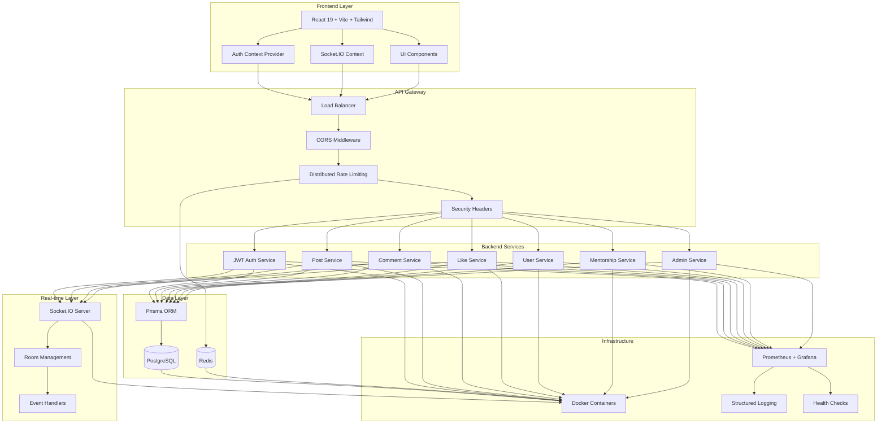

# Technical Architecture Diagram
## Knowledge Sharing & Mentorship Platform

## Key Architecture Decisions

### **Scalability Patterns**
- **Horizontal Scaling**: Stateless services with Redis-backed rate limiting
- **Database Optimization**: Connection pooling, query optimization, indexing
- **Real-time Performance**: Room-based Socket.IO events
- **Caching Strategy**: Redis for rate limiting, future caching layer

### **Security Architecture**
- **Defense in Depth**: Multiple security layers (CORS, rate limiting, input validation)
- **Authentication**: JWT with refresh tokens, secure cookie implementation
- **Authorization**: Role-based access control with middleware enforcement
- **Data Protection**: XSS/SQL/CSRF protection, input sanitization

### **Performance Engineering**
- **Connection Management**: Database connection pooling, timeout enforcement
- **Load Handling**: Distributed rate limiting, circuit breakers, load shedding
- **Monitoring**: Prometheus metrics, structured logging, health checks
- **Real-time Optimization**: Socket.IO room management, event batching

### **Development Practices**
- **Modular Architecture**: Service layer pattern, repository pattern
- **Error Handling**: Comprehensive error handling with proper HTTP status codes
- **Testing**: Unit tests, integration tests, API testing
- **Deployment**: Docker containerization, multi-stage builds
