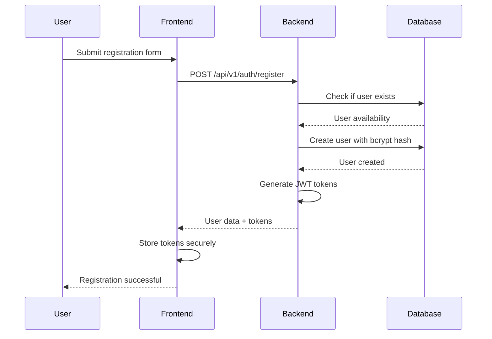
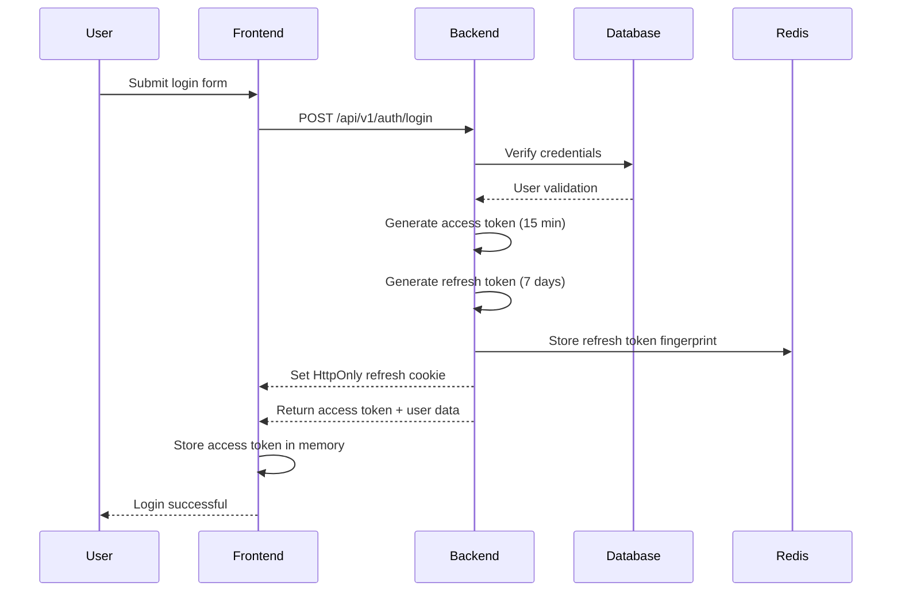
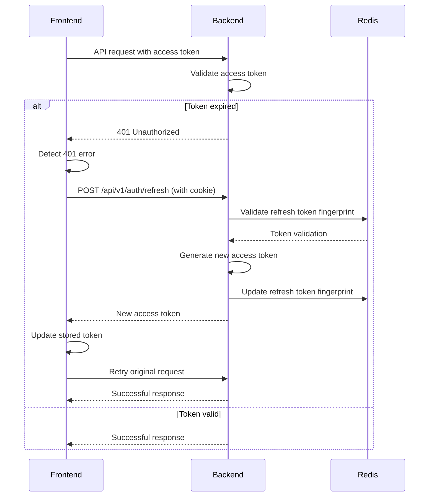
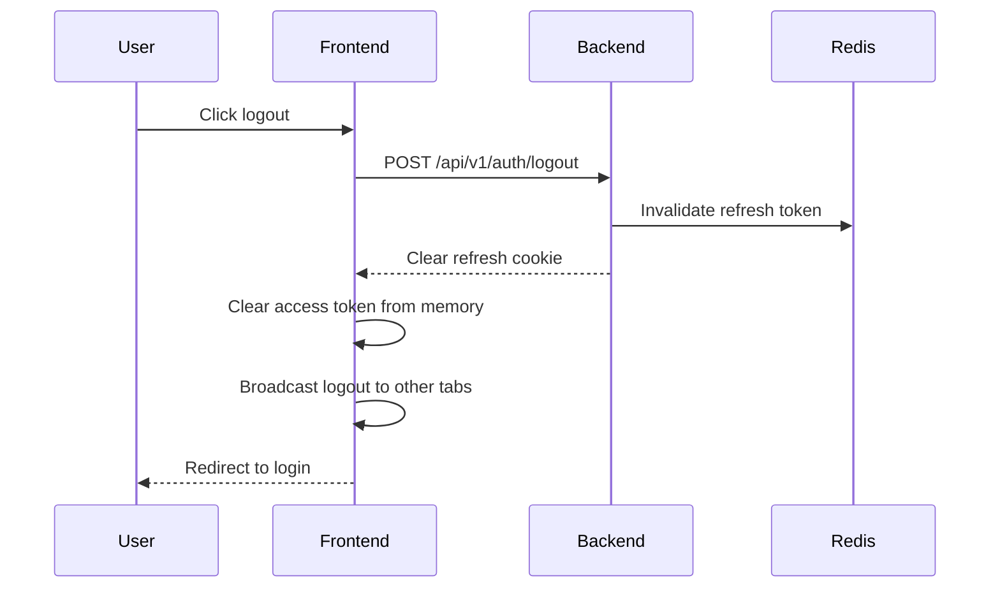

# Authentication Flow Documentation

## 🔐 Authentication Architecture

The Knowledge Sharing Tech Community implements a secure, production-ready authentication system with JWT tokens, refresh mechanisms, and comprehensive security measures.

## 🎯 Authentication Goals

- **Security**: Zero-trust architecture with defense in depth
- **Usability**: Seamless user experience with automatic token refresh
- **Scalability**: Handle thousands of concurrent authenticated users
- **Compliance**: Industry best practices for token management

## 🔄 Authentication Flow

### 1. User Registration


### 2. User Login


### 3. Token Refresh (Automatic)


### 4. User Logout


## 🛡️ Security Implementation

### JWT Token Configuration
```javascript
// Access Token (15 minutes)
{
  "iss": "knowledge-sharing-backend",
  "sub": "user_123",
  "email": "user@example.com",
  "role": "USER",
  "iat": 1640995200,
  "exp": 1640996100,
  "jti": "token_uuid"
}

// Refresh Token (7 days, HttpOnly cookie)
{
  "id": "refresh_token_uuid",
  "userId": "user_123",
  "fingerprint": "sha256_hash",
  "expiresAt": "2024-01-08T12:00:00Z"
}
```

### Security Measures

#### 1. Token Storage
- **Access Token**: Memory only (no localStorage)
- **Refresh Token**: HttpOnly, Secure, SameSite=strict cookie
- **XSS Protection**: HttpOnly prevents JavaScript access
- **CSRF Protection**: SameSite=strict prevents cross-site requests

#### 2. Token Validation
```javascript
// JWT verification with clock drift tolerance
jwt.verify(token, secret, {
  clockTolerance: 30, // 30 seconds drift tolerance
  algorithms: ['HS256']
});
```

#### 3. Refresh Token Security
- **Fingerprinting**: SHA-256 hash for O(1) lookup
- **Rotation**: New token on each refresh
- **Invalidation**: Immediate revocation on logout
- **Rate Limiting**: Prevent brute force attacks

#### 4. Rate Limiting
```javascript
// Authentication-specific rate limits
const rateLimits = {
  login: { requests: 5, window: '1m', key: 'ip' },
  register: { requests: 3, window: '1m', key: 'ip' },
  refresh: { requests: 10, window: '1m', key: 'user' }
};
```

## 🔧 Frontend Implementation

### Token Management
```typescript
// tokenManager.ts
class TokenManager {
  private accessToken: string | null = null;
  
  setAccessToken(token: string) {
    this.accessToken = token;
  }
  
  getAccessToken(): string | null {
    return this.accessToken;
  }
  
  clearTokens() {
    this.accessToken = null;
    // Refresh cookie cleared by backend
  }
  
  // Automatic token refresh
  async refreshAccessToken(): Promise<string> {
    const response = await apiService.post('/auth/refresh');
    this.setAccessToken(response.data.accessToken);
    return response.data.accessToken;
  }
}
```

### API Interceptor
```typescript
// axios interceptor for automatic refresh
apiClient.interceptors.response.use(
  (response) => response,
  async (error) => {
    if (error.response?.status === 401) {
      try {
        const newToken = await tokenManager.refreshAccessToken();
        error.config.headers.Authorization = `Bearer ${newToken}`;
        return apiClient.request(error.config);
      } catch (refreshError) {
        tokenManager.clearTokens();
        window.location.href = '/signin';
      }
    }
    return Promise.reject(error);
  }
);
```

### Cross-Tab Synchronization
```typescript
// Broadcast logout to other tabs
const broadcastLogout = () => {
  const event = new CustomEvent('auth-logout-from-other-tab');
  window.dispatchEvent(event);
  
  // Also use localStorage for cross-tab communication
  localStorage.setItem('auth-logout', Date.now().toString());
};

// Listen for logout from other tabs
window.addEventListener('storage', (e) => {
  if (e.key === 'auth-logout') {
    logout();
  }
});
```

## 🔧 Backend Implementation

### Authentication Middleware
```javascript
// authMiddleware.js
const authenticateToken = (req, res, next) => {
  const authHeader = req.headers['authorization'];
  const token = authHeader && authHeader.split(' ')[1];

  if (!token) {
    return res.status(401).json({ error: 'Access token required' });
  }

  jwt.verify(token, process.env.JWT_SECRET, { clockTolerance: 30 }, (err, user) => {
    if (err) {
      return res.status(401).json({ error: 'Invalid token' });
    }
    req.user = user;
    next();
  });
};
```

### Refresh Token Service
```javascript
// refreshTokenService.js
class RefreshTokenService {
  async generateRefreshToken(userId) {
    const token = uuidv4();
    const fingerprint = crypto.createHash('sha256')
      .update(`${userId}-${token}-${Date.now()}`)
      .digest('hex');
    
    await prisma.refreshToken.create({
      data: {
        userId,
        tokenHash: fingerprint,
        expiresAt: new Date(Date.now() + 7 * 24 * 60 * 60 * 1000)
      }
    });
    
    return { token, fingerprint };
  }
  
  async validateRefreshToken(token, userId) {
    const fingerprint = crypto.createHash('sha256')
      .update(token)
      .digest('hex');
    
    const storedToken = await prisma.refreshToken.findFirst({
      where: {
        userId,
        tokenHash: fingerprint,
        expiresAt: { gt: new Date() }
      }
    });
    
    return storedToken;
  }
}
```

### Security Headers
```javascript
// securityMiddleware.js
app.use(helmet({
  contentSecurityPolicy: {
    directives: {
      defaultSrc: ["'self'"],
      styleSrc: ["'self'", "'unsafe-inline'"],
      scriptSrc: ["'self'"],
      imgSrc: ["'self'", "data:", "https:"],
    },
  },
  hsts: {
    maxAge: 31536000,
    includeSubDomains: true,
    preload: true
  }
}));
```

## 📊 Authentication Metrics

### Security Events Tracked
```javascript
// Security event logging
{
  "type": "security",
  "event": "auth_success",
  "userId": "user_123",
  "ip": "192.168.1.100",
  "userAgent": "Mozilla/5.0...",
  "timestamp": "2024-01-01T12:00:00Z"
}

{
  "type": "security",
  "event": "auth_failure",
  "reason": "invalid_credentials",
  "ip": "192.168.1.100",
  "attempts": 3,
  "timestamp": "2024-01-01T12:00:00Z"
}
```

### Performance Metrics
- **Login Response Time**: p95 < 1s
- **Token Refresh Time**: p95 < 500ms
- **Authentication Error Rate**: < 1%
- **Concurrent Sessions**: 1000+ supported

## 🚨 Security Monitoring

### Threat Detection
1. **Brute Force Attacks**: Multiple failed attempts from same IP
2. **Token Abuse**: Unusual token usage patterns
3. **Session Hijacking**: Concurrent sessions from different locations
4. **Rate Limit Violations**: Excessive authentication attempts

### Automated Responses
- **IP Blocking**: Temporary blocks for suspicious activity
- **Account Locking**: Temporary locks after multiple failures
- **Token Invalidation**: Force logout on security events
- **Alert Notifications**: Security team notifications

## 🔄 Session Management

### Session Lifecycle
1. **Creation**: Login generates access + refresh tokens
2. **Extension**: Automatic refresh extends session
3. **Validation**: Each request validates access token
4. **Termination**: Logout invalidates all tokens

### Session Security
- **Timeout**: Access token expires after 15 minutes
- **Rotation**: Refresh token changes on each use
- **Revocation**: Immediate invalidation on logout
- **Cleanup**: Automatic cleanup of expired tokens

## 🧪 Testing Authentication

### Test Scenarios
```typescript
// Authentication flow tests
describe('Authentication', () => {
  test('successful login with valid credentials', async () => {
    const response = await apiService.login({
      email: 'test@example.com',
      password: 'password123'
    });
    
    expect(response.status).toBe(200);
    expect(response.data.accessToken).toBeDefined();
    expect(response.data.user.email).toBe('test@example.com');
  });
  
  test('automatic token refresh on 401', async () => {
    // Mock expired token
    mockTokenExpired();
    
    const response = await apiService.getPosts();
    
    expect(response.status).toBe(200);
    expect(tokenRefreshCalled).toBe(true);
  });
  
  test('logout invalidates tokens', async () => {
    await apiService.logout();
    
    const response = await apiService.getPosts();
    expect(response.status).toBe(401);
  });
});
```

### Security Tests
```typescript
// Security validation tests
describe('Security', () => {
  test('password hashing with bcrypt >= 12', async () => {
    const hash = await bcrypt.hash('password', 12);
    expect(bcrypt.getRounds(hash)).toBeGreaterThanOrEqual(12);
  });
  
  test('JWT token expiration enforcement', async () => {
    const token = generateExpiredToken();
    const response = await apiService.getProfile(token);
    expect(response.status).toBe(401);
  });
  
  test('rate limiting on login endpoint', async () => {
    for (let i = 0; i < 6; i++) {
      await apiService.login(invalidCredentials);
    }
    const response = await apiService.login(invalidCredentials);
    expect(response.status).toBe(429);
  });
});
```

## 📈 Authentication Performance

### Optimization Strategies
1. **Token Caching**: In-memory token validation cache
2. **Database Indexing**: Optimized user lookup queries
3. **Connection Pooling**: Efficient database connections
4. **Async Operations**: Non-blocking I/O operations

### Performance Benchmarks
| Operation | Target | Actual |
|-----------|--------|---------|
| Login | < 1s | TBD |
| Token Refresh | < 500ms | TBD |
| Token Validation | < 100ms | TBD |
| Logout | < 500ms | TBD |

## 🔮 Future Enhancements

### Planned Improvements
- **Multi-Factor Authentication**: TOTP/SMS support
- **Social Login**: OAuth2 integration
- **Device Management**: Device-specific sessions
- **Biometric Auth**: WebAuthn support
- **Zero Trust**: Continuous authentication

### Scalability Plans
- **Distributed Sessions**: Redis cluster for session storage
- **Token Service**: Dedicated microservice for token management
- **Event Sourcing**: Audit trail for authentication events
- **Machine Learning**: Anomaly detection for security

**Authentication Maturity Level: 98%**
