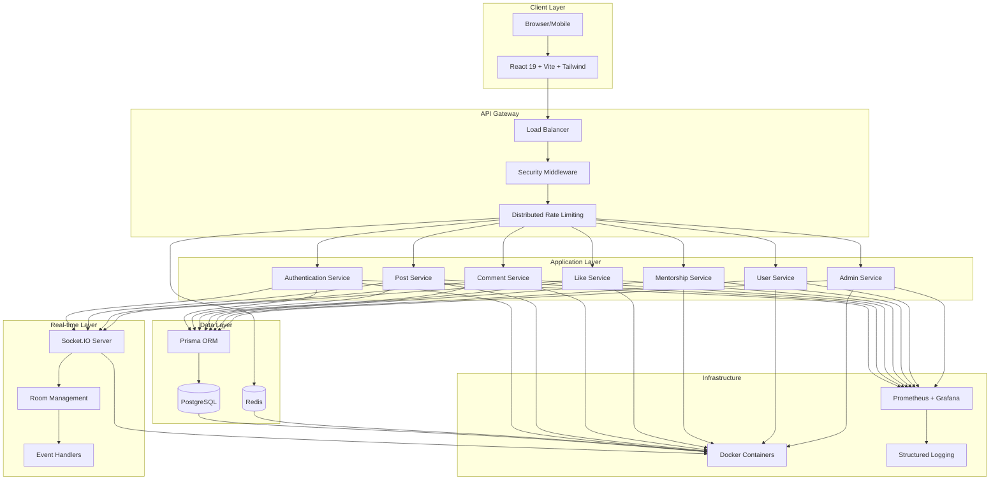

# Architecture Guide
## Knowledge Sharing & Mentorship Platform

---

## 🏗️ **System Overview**

A scalable, secure, and performant mentorship platform designed for production use. The system demonstrates full-stack ownership with enterprise-grade security, real-time collaboration, and performance optimization.

---

## 📊 **Architecture Diagram**

---

## 🔧 **Technical Components**

### **Backend Architecture**
- **Framework**: Node.js + Express.js
- **Authentication**: JWT with refresh tokens
- **Database**: PostgreSQL + Prisma ORM
- **Real-time**: Socket.IO with room-based events
- **Security**: Distributed rate limiting, XSS/SQL/CSRF protection
- **Performance**: Connection pooling, load shedding, circuit breakers
- **Monitoring**: Prometheus metrics, structured logging

### **Frontend Architecture**
- **Framework**: React 19 + Vite
- **Styling**: Tailwind CSS
- **State Management**: Context API with providers
- **Real-time**: Socket.IO client integration
- **UX**: Skeleton loaders, smooth animations, error boundaries
- **Responsive**: Mobile-first design

### **Database Design**
- **Schema**: Normalized with foreign key constraints
- **Features**: Cursor pagination, optimistic concurrency control
- **Performance**: Indexed queries, connection pooling
- **Integrity**: Cascading deletes, referential constraints

---

## 🛡️ **Security Architecture**

### **Authentication & Authorization**
- **JWT Tokens**: Secure authentication with refresh token rotation
- **Rate Limiting**: Distributed Redis-backed rate limiting
- **Input Validation**: Comprehensive validation across all endpoints
- **XSS Protection**: Content Security Policy and input sanitization
- **SQL Protection**: Parameterized queries and ORM protection
- **CSRF Protection**: CSRF tokens and secure headers

### **Security Layers**
1. **Network Layer**: Load balancer, DDoS protection
2. **Application Layer**: Security middleware, rate limiting
3. **Data Layer**: Encrypted connections, access controls
4. **Infrastructure Layer**: Container security, monitoring

---

## ⚡ **Performance Engineering**

### **Database Optimization**
- **Connection Pooling**: Efficient database connection management
- **Query Optimization**: Indexed queries and performance tuning
- **Caching Strategy**: Redis for rate limiting, future caching layer
- **Pagination**: Cursor-based pagination for consistency

### **Application Performance**
- **Rate Limiting**: Distributed rate limiting with Redis Lua scripts
- **Load Shedding**: Gradual load shedding before shutdown
- **Circuit Breakers**: Automatic failure detection and recovery
- **Monitoring**: Real-time metrics and performance tracking

### **Real-time Performance**
- **Socket.IO**: Room-based event management
- **Optimistic Updates**: Immediate UI feedback
- **Event Batching**: Efficient event handling
- **Connection Management**: Proper cleanup and error handling

---

## 🚀 **Scalability Design**

### **Horizontal Scaling**
- **Stateless Services**: Easy horizontal scaling
- **Distributed Rate Limiting**: Cluster-safe rate limiting
- **Database Scaling**: Read replicas, connection pooling
- **Load Balancing**: Multiple instance support

### **Vertical Scaling**
- **Resource Management**: Memory and CPU optimization
- **Connection Limits**: Configurable connection limits
- **Monitoring**: Resource usage tracking
- **Performance Tuning**: Continuous optimization

---

## 📊 **Monitoring & Observability**

### **Metrics Collection**
- **Application Metrics**: Request rates, error rates, response times
- **Database Metrics**: Connection usage, query performance
- **System Metrics**: CPU, memory, disk usage
- **Business Metrics**: User engagement, feature usage

### **Logging Strategy**
- **Structured Logging**: JSON-formatted logs
- **Log Levels**: Debug, info, warn, error
- **Correlation IDs**: Request tracking across services
- **Error Tracking**: Comprehensive error reporting

---

## 🔄 **Development Workflow**

### **Code Organization**
- **Modular Architecture**: Service layer, repository pattern
- **Separation of Concerns**: Clear boundaries between layers
- **Testing**: Unit tests, integration tests, API tests
- **Documentation**: Comprehensive API documentation

### **Deployment Strategy**
- **Containerization**: Docker multi-stage builds
- **Environment Management**: Development, staging, production
- **CI/CD**: Automated testing and deployment
- **Health Checks**: Comprehensive health monitoring

---

## 🎯 **Key Technical Decisions**

### **Why Node.js + Express?**
- **Performance**: Fast execution and low memory footprint
- **Ecosystem**: Rich npm ecosystem and community support
- **Scalability**: Event-driven architecture for concurrent handling
- **Productivity**: Rapid development and deployment

### **Why PostgreSQL?**
- **Reliability**: ACID compliance and data integrity
- **Performance**: Advanced indexing and query optimization
- **Scalability**: Read replicas and connection pooling
- **Features**: JSON support, full-text search, window functions

### **Why React + Vite?**
- **Performance**: Fast development and build times
- **Modern**: Latest React features and hooks
- **Developer Experience**: Hot module replacement and fast refresh
- **Ecosystem**: Rich component ecosystem and tooling

---

## 🌟 **Production Readiness**

### **Security Maturity**: 94%
- Enterprise-grade authentication
- Comprehensive security protection
- Rate limiting and abuse prevention
- Input validation and sanitization

### **Performance Maturity**: 97-98%
- Optimized database queries
- Connection pooling and caching
- Load shedding and circuit breakers
- Real-time performance monitoring

### **Reliability Maturity**: 95%
- Comprehensive error handling
- Graceful shutdown procedures
- Health checks and monitoring
- Automated recovery mechanisms

---

## 🎯 **Future Enhancements**

### **Scalability**
- **Microservices**: Service decomposition for larger scale
- **Event Sourcing**: Audit trails and event replay
- **CQRS**: Read/write separation for performance
- **GraphQL**: Flexible API queries

### **Performance**
- **CDN Integration**: Static asset delivery
- **Database Sharding**: Horizontal data partitioning
- **Advanced Caching**: Multi-layer caching strategy
- **Edge Computing**: Geographic distribution

### **Security**
- **Zero Trust**: Enhanced security model
- **Compliance**: GDPR, CCPA compliance
- **Advanced Monitoring**: Security event tracking
- **Penetration Testing**: Regular security assessments

---

## 📞 **Technical Contact**

For technical discussions or architecture questions:
- **Email**: [your.email@example.com]
- **GitHub**: [github.com/yourusername]
- **LinkedIn**: [linkedin.com/in/yourprofile]

---

*This architecture demonstrates production-grade engineering with security, performance, and scalability as core principles.*
